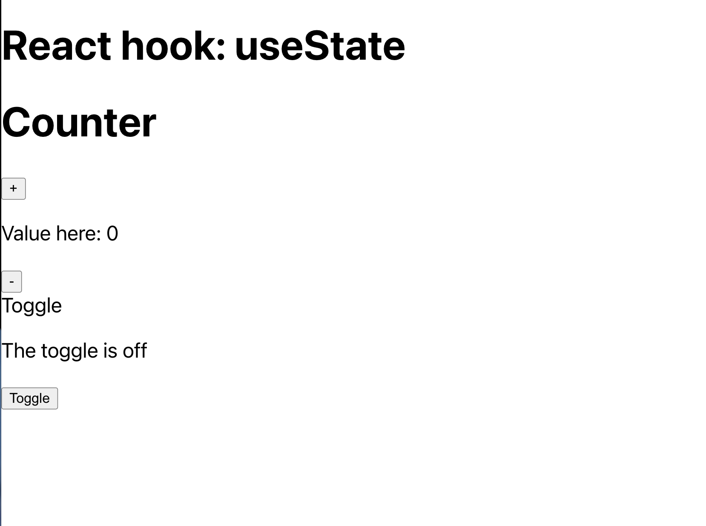

# React hook - useState

useState is a React Hook that lets you add a state variable to your component.

const [state, setState] = useState(initialState);

## How to run the project

1. Step 1: yarn
2. Step 2: yarn start

## Requirements

1. Counter: when the user clicks the `+` button, it should increase the value and same logic with the `-` button
2. Toggle

## Screenshot



## Hints

1. `onClick`: A MouseEvent handler function. Fires when the primary button was clicked on the pointing device.

Example:

```
<button onClick={handleClick}>
        Click me!
 </button>
```

2. Ternary syntax will be using in Toggle
   The conditional (ternary) operator is the only JavaScript operator that takes three operands: a condition followed by a question mark (?), then an expression to execute if the condition is truthy followed by a colon (:), and finally the expression to execute if the condition is falsy. This operator is frequently used as an alternative to an if...else statement.

Syntax: condition ? exprIfTrue : exprIfFalse

Example:

```
let x = 10;
let y = 5;
let result = x > y ? "x is greater than y" : "x is less than or equal to y";
console.log(result);
```
